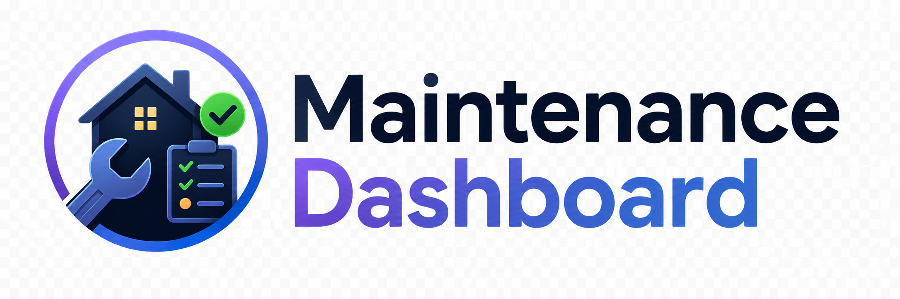
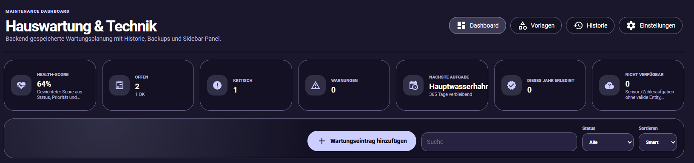
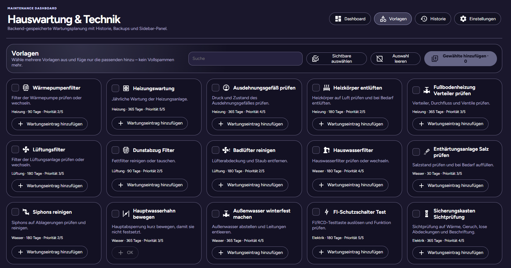
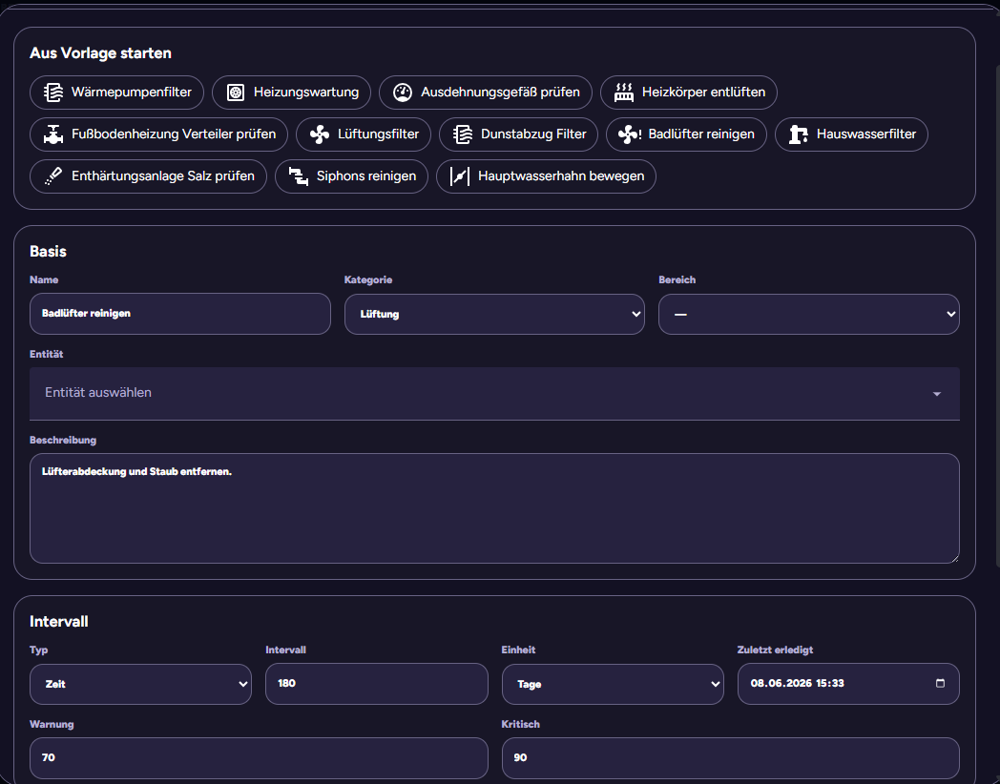
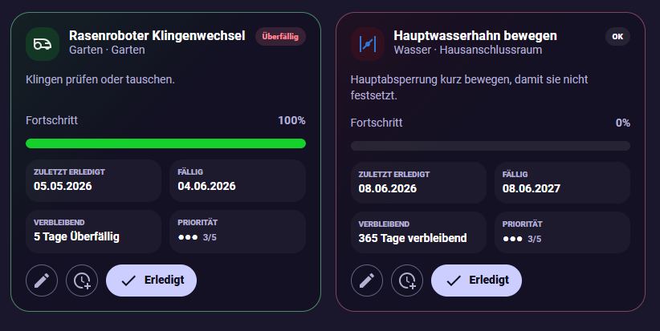

<p align="center">
  
</p>

<h1 align="center">Maintenance Dashboard</h1>

<p align="center">
  A dedicated Home Assistant integration for recurring maintenance, calendar schedules, one-time tasks, service history, starter packs, notifications and safe backend storage.
</p>

Maintenance Dashboard adds its own Home Assistant sidebar panel. It is not a Lovelace card and does not require dashboard YAML. Tasks, history, settings and backups are owned by the integration backend and remain independent from the frontend panel configuration.

## Highlights

- Dedicated Home Assistant sidebar panel
- Backend-managed storage through Home Assistant's internal storage layer
- Interval, one-time, monthly, yearly and seasonal schedules
- Time-, sensor- and consumption-based maintenance tracking
- Completion history with notes, materials, cost and performed-by metadata
- Undo support for completion events
- Automatic rolling backups before mutations and imports
- Soft-delete and restore behavior
- 80 built-in maintenance templates
- Categories, tags, popular/common filters and template previews
- First-run onboarding with selectable starter packs
- Smart sorting based on status, priority, due date and manual position
- Responsive desktop and mobile interface
- Notification Rules v2 with repeats, escalation, quiet hours, previews and actionable mobile actions
- Global and dynamically managed per-task Home Assistant entities
- Full JSON export/import and diagnostics
- Versioned additive storage migrations with pre-migration safety backups
- Integrity checks, Home Assistant Repairs, quarantine and technical audit log
- Named and pinned backups, rotation, comparison and selective restore
- Import preview with merge/replace and duplicate-handling strategies
- Grid, list and timeline dashboard views
- Advanced and saved filters, multi-selection and previewed bulk actions
- Configurable dashboard widgets and persistent ordering
- Quick-filter chips, compact density, pinned filters and expanded bulk actions
- Native Home Assistant To-do and Calendar platforms
- Native device triggers and conditions for maintenance automations

## Preview

### Dashboard



### Template library



### Task editor



### Task cards



## Scheduling modes

| Mode | Behavior | Example |
| --- | --- | --- |
| Interval | Next due date is calculated from the last completion | Replace a filter every 90 days |
| One-time | Uses one due date and is archived after completion | Arrange an inspection before a specific date |
| Monthly | Runs on a fixed day of every month | Review water usage on the first day of the month |
| Yearly | Runs on a fixed month and day every year | Check heating before September |
| Seasonal | Runs once per selected season every year | Winterize outdoor water in autumn |
| Meter | Tracks a Home Assistant entity against a configurable limit | Service a device after a runtime threshold |

Calendar calculations clamp invalid dates safely. For example, a monthly task configured for day 31 is moved to the final valid day of shorter months.

### One-time tasks

Completed one-time tasks are archived instead of becoming due again. They remain available in history and in the optional completed-task view. An archived one-time task can be reactivated from the dashboard or through the `maintenance_dashboard.reactivate_task` service.

## Completion history

When completing a task, the panel can store:

- Completion note
- Used material or replacement parts
- Cost and currency
- Person who performed the work
- Runtime state before completion
- Previous and new task state

History can be filtered by text, task and action type. Stored before/after values are shown as a compact field diff, and supported completion events can be undone.

## Template library and onboarding

The integration includes 80 brand-neutral templates for:

- Heating and ventilation
- Water and leak protection
- Electrical systems and safety
- Solar and energy
- Garden and seasonal work
- Building envelope and moisture checks
- Garage and mobility
- IT, network and backup
- Household appliances

Templates support categories, tags, popular/common flags, seasonal metadata and schedule previews. Multiple templates can be selected and added together.

First-run onboarding offers selectable starter packs such as:

- Home essentials
- Safety first
- Heating and indoor air
- Garden and seasonal work
- Solar and energy
- IT and backup
- Household appliance care
- Water and leak protection
- Building and moisture checks
- Garage and mobility

Starter packs only add their selected templates and never replace existing tasks.

## Installation

### HACS

1. Open HACS in Home Assistant.
2. Open the three-dot menu and select **Custom repositories**.
3. Add the public GitHub repository URL.
4. Select **Integration** as the category.
5. Install **Maintenance Dashboard**.
6. Restart Home Assistant.
7. Open **Settings → Devices & services → Add integration**.
8. Add **Maintenance Dashboard**.

After setup, the **Maintenance** entry appears in the Home Assistant sidebar.

### Manual installation

Copy the integration directory into your Home Assistant configuration:

```bash
cp -r custom_components/maintenance_dashboard /config/custom_components/
```

Restart Home Assistant and add the integration through:

```text
Settings → Devices & services → Add integration → Maintenance Dashboard
```

## Services

### Mark a task as completed

```yaml
service: maintenance_dashboard.mark_done
data:
  task_id: robot_mower_blades
  note: Replaced all blades and cleaned the cutting deck.
  material: Replacement blade set
  cost: 18.90
  currency: EUR
  performed_by: Mickey
```

### Reactivate a completed one-time task

```yaml
service: maintenance_dashboard.reactivate_task
data:
  task_id: annual_inspection
```

### Snooze a task

```yaml
service: maintenance_dashboard.snooze
data:
  task_id: robot_mower_blades
  days: 7
```

### Clear a snooze

```yaml
service: maintenance_dashboard.clear_snooze
data:
  task_id: robot_mower_blades
```

### Send a digest

```yaml
service: maintenance_dashboard.send_digest
data:
  notify_service: notify.mobile_app_phone
  include_ok: false
  include_snoozed: false
```

Additional services:

```text
maintenance_dashboard.restore_backup
maintenance_dashboard.restore_backup_sections
maintenance_dashboard.create_backup
maintenance_dashboard.check_integrity
maintenance_dashboard.repair_integrity
maintenance_dashboard.bulk_operation
maintenance_dashboard.test_notification
maintenance_dashboard.notify_task
maintenance_dashboard.notify_due_tasks
maintenance_dashboard.process_notifications
maintenance_dashboard.cleanup_task_entities
maintenance_dashboard.clear_notification_history
```

## Notification Rules v2

Maintenance Dashboard can use any Home Assistant `notify.*` service. If no notify service is configured, notifications fall back to `persistent_notification.create`. Action buttons are included when the selected notification target supports Home Assistant Companion actionable notifications.

Global notification settings include:

- Warning, critical, overdue and unavailable-task rules
- Once-per-status delivery or configurable repeat intervals
- Escalation after a configurable number of overdue days
- Quiet-hour suppression, including windows crossing midnight
- Daily digests optionally grouped by category
- Dashboard links, snoozed-task inclusion and test mode
- Configurable **Done**, **Snooze**, and **Open dashboard** actions
- Notification preview and retained delivery history with configurable retention and manual clearing

Every task can inherit the global rules or override its own statuses, repeat interval, escalation behavior, actionable-notification setting and notify service from the advanced editor section.

Automatic processing records the last delivered status and escalation level. This prevents repeated notifications after Home Assistant restarts while still allowing deliberately configured reminders.

An optional event-based automation blueprint is included at:

```text
blueprints/automation/maintenance_dashboard/maintenance_notifications.yaml
```

Copy it into the matching directory below `/config/blueprints/` when the repository installation method does not deploy top-level blueprint files. The blueprint supports an **Integration rules** mode that delegates warning and critical event delivery to the built-in deduplication and quiet-hour engine, plus a **Direct** mode for explicit event-to-notify-service delivery.

### Home Assistant events

The integration fires automation-ready events containing task ID, name, status, priority, due date and dashboard URL:

```text
maintenance_dashboard_task_status_changed
maintenance_dashboard_task_warning
maintenance_dashboard_task_critical
maintenance_dashboard_task_overdue
maintenance_dashboard_task_unavailable
maintenance_dashboard_task_completed
maintenance_dashboard_task_snoozed
```

The generic status event also includes `previous_status` and the update reason.

## Entities

Global entities include:

```text
sensor.maintenance_dashboard_health_score
sensor.maintenance_dashboard_active_tasks
sensor.maintenance_dashboard_critical_tasks
sensor.maintenance_dashboard_warning_tasks
sensor.maintenance_dashboard_unavailable_tasks
sensor.maintenance_dashboard_completed_this_year
sensor.maintenance_dashboard_next_task
binary_sensor.maintenance_dashboard_has_critical_tasks
binary_sensor.maintenance_dashboard_has_warning_tasks
```

Optional per-task entity modes:

| Mode | Generated entities |
| --- | --- |
| `off` | No individual task entities |
| `due_only` | Due binary sensor |
| `basic` | Due, remaining and progress |
| `full` | Basic entities plus due date, last done and status |

Entity modes are synchronized dynamically after settings changes. Generated entities use an immutable backend-owned entity key, so renaming a task does not change its unique ID.

Device grouping can be configured as:

| Grouping | Behavior |
| --- | --- |
| `none` | Generated task entities are not attached to a virtual device |
| `dashboard` | All global and task entities belong to the Maintenance Dashboard device |
| `category` | Task entities are grouped below category-specific virtual devices |

Deleted tasks and reduced entity modes intentionally leave registry records available unless cleanup is enabled. Use **Clean up task entities** from the settings dialog or call `maintenance_dashboard.cleanup_task_entities` to remove orphaned entries. Automatic cleanup can also be enabled in entity settings.

## Dashboard views and bulk operations

The dashboard supports three persistent layouts:

| View | Purpose |
| --- | --- |
| Grid | Full maintenance cards with progress and actions |
| List | Dense list for larger task collections |
| Timeline | Chronological due-date stream |

Advanced filters cover category, area, status, priority, schedule mode, due range, tags and entity availability. Filter combinations can be named and saved in the backend.

Tasks can be selected individually or in groups. Supported bulk actions include completing, snoozing, clearing snoozes, changing category, area or priority, enabling, disabling, deleting, restoring, duplicating and exporting selected tasks. Mutating bulk actions show a preview and can create an automatic safety backup before execution.

Dashboard status values are shown in a compact top status line instead of large KPI cards. Available dashboard metrics include health score, open tasks, critical tasks, warnings, due today, completed tasks and unavailable tasks.

Version 1.7.2 streamlines the dashboard header, hides quick-filter chips behind a filter control by default, moves task creation into a floating action button and keeps the primary workspace focused on Grid, List and Timeline.

## Native Home Assistant platforms

Version 1.6.0 can expose Maintenance Dashboard through native Home Assistant platforms:

```text
todo.maintenance_dashboard_tasks
calendar.maintenance_dashboard_schedule
```

The To-do platform supports creating, updating, completing, deleting and reordering maintenance tasks. To-do completion is synchronized back to the maintenance history. The Calendar platform exposes calculated due dates for active tasks.

Both platforms can be disabled independently in the integration settings.

Native device automation support includes:

- Triggers for status changes, warning, critical, overdue and completion events
- Conditions for any critical task, due tasks in a category and a specific overdue task

## Data integrity and recovery

Version 1.6.0 introduces an application-level storage schema with additive migrations. Existing unknown fields are preserved, the Home Assistant Store serializer version remains stable, and a safety backup can be created before migration.

The integrity engine checks tasks, history, backups, notification state, quarantine and audit records. It detects duplicate or missing IDs, invalid schedules and thresholds, broken timestamps, orphaned references and malformed backup snapshots.

Safe problems can be repaired automatically. Records that cannot be normalized are moved to quarantine instead of being deleted. Quarantined data can be inspected, exported, restored or deliberately removed from the Data Safety dialog.

Home Assistant Repairs issues are created for:

- Data-integrity errors
- Failed storage migrations
- Invalid or missing notify services
- Unreadable backup records

The technical audit log records task mutations, settings changes, imports, backups, restores, repairs and bulk operations with timestamps, source information and before/after data where available.

## Backup and import workflow

Automatic backups are rotated by configurable maximum count and age. Manual backups can be named and pinned; pinned backups are excluded from automatic rotation.

Backup snapshots can include:

- Tasks
- History
- Settings
- Notification state and delivery history
- Quarantine
- Audit log

Before restoring, the panel can calculate a task-level diff showing added, removed and changed tasks with field-level before/after values. Restore can target complete sections or selected changed tasks only. A fresh safety backup is created before restore when enabled.

JSON import uses a staged workflow:

1. Parse and validate the payload.
2. Normalize records without dropping unknown fields.
3. Show an import preview and integrity result.
4. Create a safety backup.
5. Apply replace or merge mode.
6. Handle duplicate IDs by skipping, overwriting or generating new IDs.
7. Run a post-import integrity check.

A failed import restores the pre-import in-memory state and leaves the existing storage unchanged.

## Data storage and safety

Maintenance Dashboard does not store task definitions in Lovelace configuration and does not use the Recorder database as its primary application database. It uses Home Assistant's internal storage layer for:

```text
maintenance_dashboard.tasks
maintenance_dashboard.history
maintenance_dashboard.backups
maintenance_dashboard.settings
maintenance_dashboard.notification_state
maintenance_dashboard.meta
maintenance_dashboard.quarantine
maintenance_dashboard.audit
```

Safety behavior:

- A backup is created before task mutations and full imports.
- Deletes are soft deletes where possible.
- Completion events preserve the previous task state for undo.
- Existing warning and critical thresholds are retained during partial updates.
- Older task records are normalized additively when loaded.
- Unknown task fields are preserved where possible.
- Full JSON export/import is available from the Data Safety dialog, including notification settings, delivery history and deduplication state.
- Storage documents are migrated additively through the integration-owned schema version.
- Invalid records are quarantined rather than silently removed.
- Automatic backup rotation honors pinned backups.
- Backup diff and selective restore preserve sections that were not selected.
- Imports are previewed and rolled back in memory when validation or persistence fails.

## Development

Install frontend dependencies:

```bash
npm ci
```

Build the browser panel:

```bash
npm run build
```

Run all unit tests:

```bash
npm test
```

Run individual suites:

```bash
npm run test:scheduling
npm run test:templates
```

Run the complete validation set:

```bash
npm ci --no-audit --no-fund
npm run validate
```

The validation command builds the frontend bundle, checks JavaScript syntax, runs all Python unit and structure tests, compiles the integration and validates versions, JSON, YAML, WebSocket contracts and release contents.

The build produces the assets Home Assistant and HACS load:

```text
custom_components/maintenance_dashboard/www/maintenance-dashboard-panel.js
custom_components/maintenance_dashboard/www/logo.png
```

These compiled assets must be committed because HACS does not build the frontend during installation.

## Repository layout

```text
custom_components/maintenance_dashboard/
├── __init__.py
├── binary_sensor.py
├── calendar.py
├── config_flow.py
├── const.py
├── data_integrity.py
├── device_condition.py
├── device_trigger.py
├── diagnostics.py
├── entity_management.py
├── manager.py
├── notification_policy.py
├── notifications.py
├── panel.py
├── recovery.py
├── repair_issues.py
├── repairs.py
├── scheduling.py
├── sensor.py
├── services.py
├── services.yaml
├── settings.py
├── storage_migrations.py
├── task_entities.py
├── templates.py
├── todo.py
├── websocket.py
└── www/
    ├── logo.png
    └── maintenance-dashboard-panel.js

frontend/src/
├── components/
├── core/
├── dialogs/
├── views/
├── api.ts
├── events.ts
├── maintenance-dashboard-panel.ts
├── state.ts
├── styles.ts
├── types.ts
└── utils.ts

tests/
├── test_data_integrity.py
├── test_manager_structure.py
├── test_notification_policy.py
├── test_recovery.py
├── test_release_structure.py
├── test_scheduling.py
├── test_settings_v16.py
├── test_storage_migrations.py
├── test_task_entities.py
└── test_templates.py
```

## License

MIT
